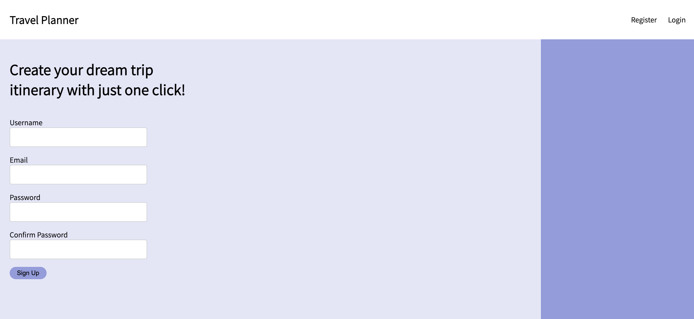
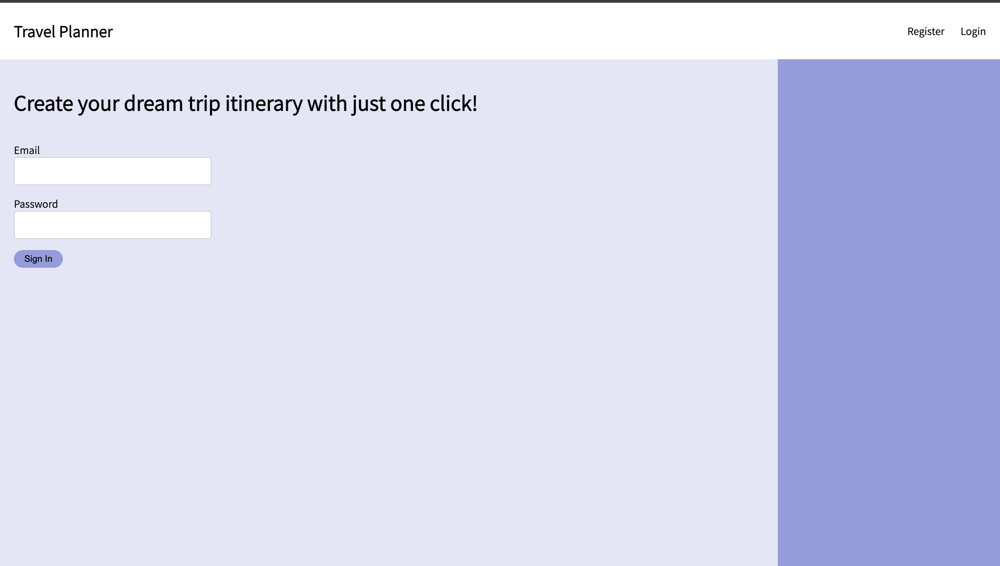
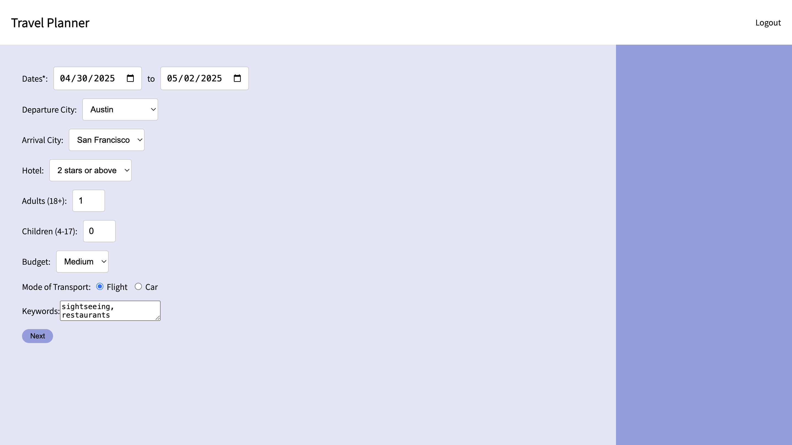
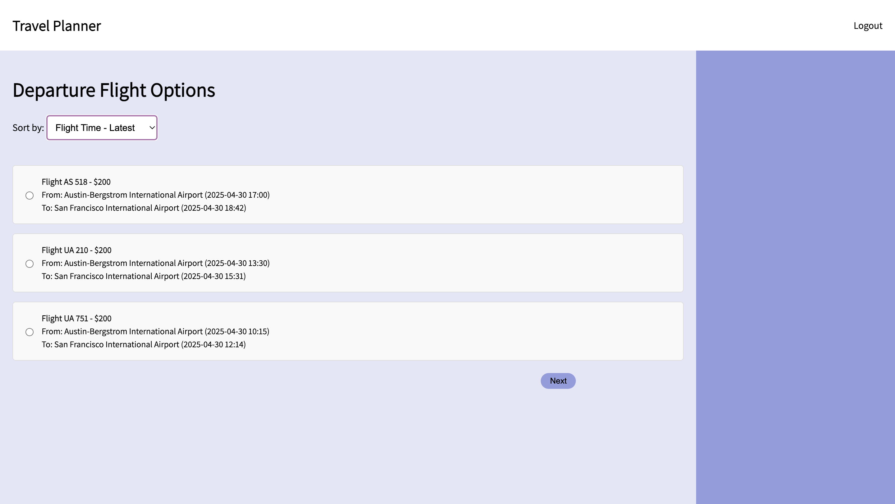
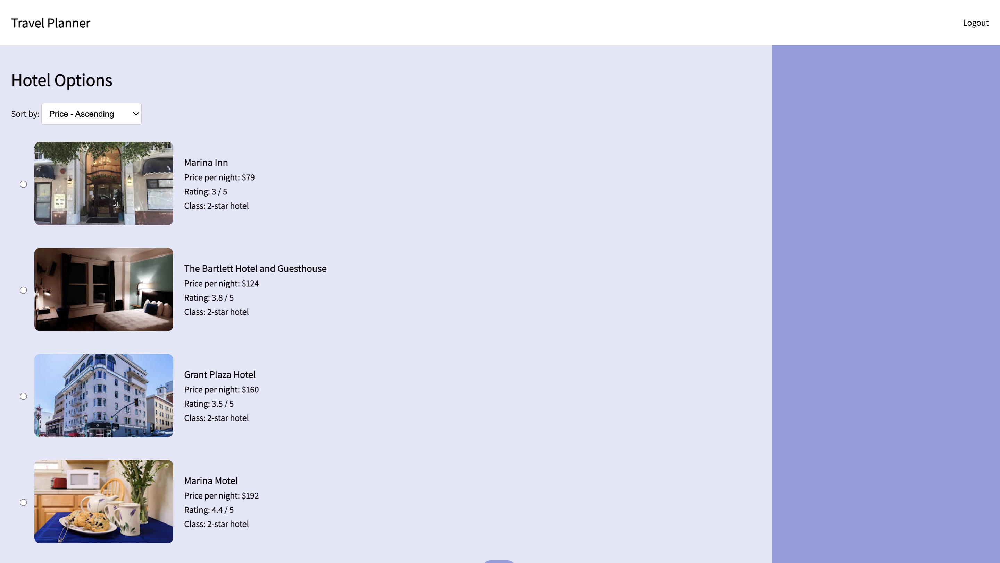
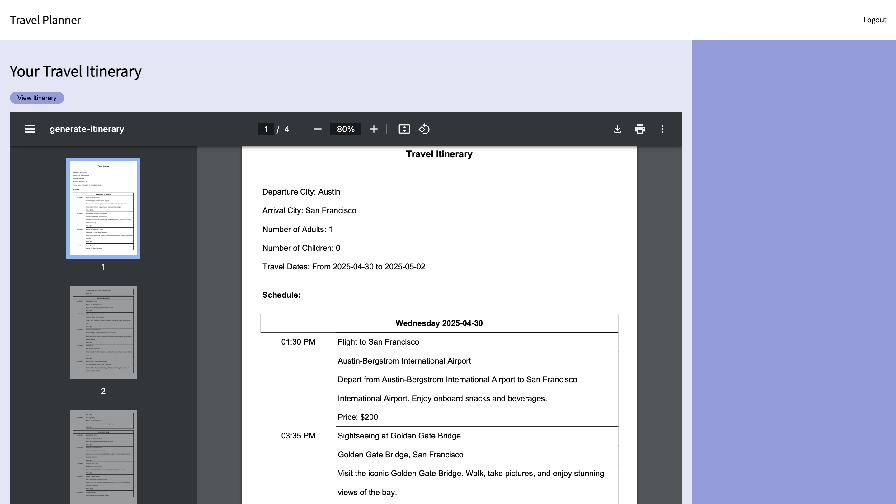

# AI Travel Planner

## 1. Project Overview, Objectives, and Goals
Our AI Studio Challenge Project was creating an Interactive AI Travel Planner with DXC Technology. The goal of this project was to provide personalized travel plans and booking recommendations tailored to user preferences. We wanted to redefine the travel planning experience by using Generative AI and near real-time data to help offer customized itineraries and booking options in a seamless manner. 

Our main objectives were to deliver travel recommendations that aligned with individual user preferences, streamline the travel planning process by incorporating real-time data, and enhance the user’s experience by providing them with an enjoyable and digestible travel planning tool. 

With this project, we recognized that travel planning could be viewed as a nuisance or overwhelming due to the immense volume of options available. Users frequently struggle to find recommendations that are both personalized and accurate, aligning with their budgets, preferences, and schedules. To address these challenges, our solution focuses on delivering time savings, improved accuracy, and an enhanced travel planning experience. We aim to inspire users to embrace travel by offering a tool that simplifies the process, making it more enjoyable and encouraging them to explore new destinations with confidence.

#### b. Methodology
We structured this project into four distinct phases: 1) Project & Data Understanding, 2) UI & Backend Development, 3) LLM Integration & Backend Expansion, and 4) Integration, Review & Deployment.
Phase 1: Project & Data Understanding (August)
Our tasks included researching relevant frameworks and tools, reconfirming requirements with our Challenge Advisors, and familiarizing ourselves with OpenAI models, SerpAPI, and JSON formatting.
Phase 2: UI & Backend Development (September)
We developed static Figma prototypes to visualize our project, created HTML/CSS templates, set up Flask frameworks, integrated HTML templates with Jinja templates, and worked with API parameters to retrieve and structure data.
Phase 3: LLM Integration & Backend Expansion (October)
This phase focused on creating and normalizing databases, refining API parameter handling for data organization, and conducting prompt engineering for the OpenAI API.
Phase 4: Integration, Review & Deployment (November)
We gathered and integrated API results with the OpenAI API, implemented a PDF generator using the FPDF library to create itineraries, and finalized the project with presentations, a detailed GitHub ReadMe, and additional documentation.

#### c. Potential Next Steps
Some potential next steps that we were thinking about were adding additional features, such as: introducing a portal page for users, referencing past itineraries, and including public transportation using real-time transit data; enhance the user interface by allowing more outbound and return flight options and providing alternative destination options for users based on previous searches; and implementing security features like two-factor authentication. Also, we want to find better LLMs with faster response rate and also allow for more human input when generating the itineraries.  

## 2. Installation 
To run this application, you will need to make a .env file and add your own SerpAPI and OpenAI API keys. Make sure Python is installed on your device. Run 
```pip install -r requirements.txt```to download all necessary dependencies

### 3. Usage
To run the app, run ```python app.py```, and open the webpage locally. Create your account and log in after. 



Put in details you want for your trip and keywords for travel preferences. 


Select flights (optional depending on whether you selected flight) and hotels. 



On the final page, click view itinerary. The itinerary may take some time to generate. View or download accordingly. 


## 4. Contributing and License

## 5. Credits and Acknowledgements 
Authored by [Jalal-Abdul Yahaya](https://github.com/905j), [Joanne Liu](https://github.com/joooanneliu), [Jen Campoverde](https://github.com/jennefercampoverde), [Lisa Farley](https://github.com/lisaf30)

Thank you DXC Technology and Cornell Break Through Tech AI for providing us with guidance and resources. 

